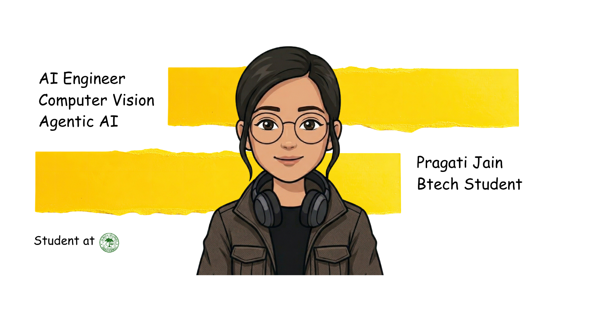

# Hey there! 👋

  

  
  

  

## 🎓 Background

- B.Tech Computer Engineering @ **Aligarh Muslim University** (2023–2027)  
- Research Intern @ **IIT BHU**  

## 🚀 Current Focus

- Animal 3D reconstruction from single-view images  
- Agentic AI systems using RAG + LangGraph  
- Exploring and applying emerging AI models across DL, and agentic AI systems  

## 🛠️ Tech Stack

### Languages & Core Tools

  
  
  
  
  
  
  
  
  
  
  
  

### AI / ML / Research

  
  
  
  
  
  

### Concepts I work with

  
  
  
  
  
  
  
  

---

## 🌟 Featured Projects

<table width="100%">
<tr>
<td width="50%" valign="top">

### 📰 NewsSure
*AI system for detecting misinformation using OCR and semantic reasoning* 
- Combines stance detection + content extraction for truth scoring  
- Generates bias insights across multiple sources  
**Tech:** `Python` `Django` `NLP` `BART` `PaddleOCR`

</td>
<td width="50%" valign="top">

### ✋ Vision-Based tracking
*Real-time hand tracking and gesture recognition system*  
- Built complete tracking + interaction pipeline  
- Optimized for real-time performance and FPS stability  
**Tech:** `OpenCV` `MediaPipe` `PnP` `Optical Flow`

</td>
</tr>
<tr>
<td width="50%" valign="top">

### 🌍 Satellite Air Quality Estimation
*AI system for estimating PM2.5 levels using satellite data*  
- Built an ensemble model combining Random Forest, XGBoost, and LightGBM  
- Applied hyperparameter tuning and model explainability for improved prediction reliability  
**Tech:** `Python` `Random Forest` `XGBoost` `LightGBM`

</td>
</tr>
</table>

---

  

---

## 📊 GitHub Analytics

  
  &nbsp;&nbsp;
  

---

   
  
  

